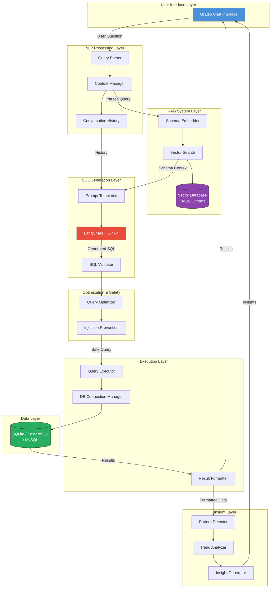
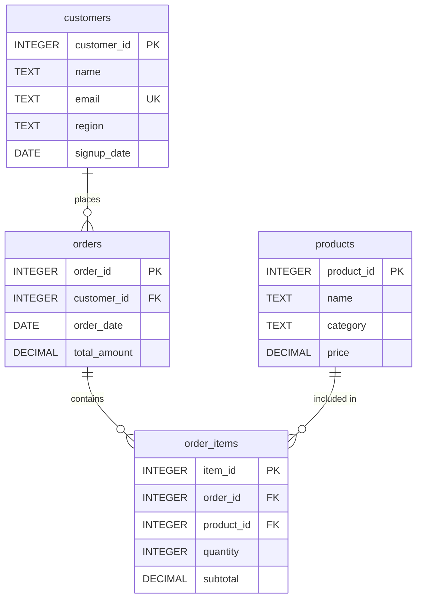
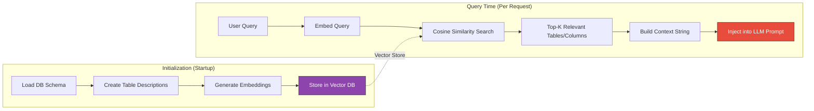
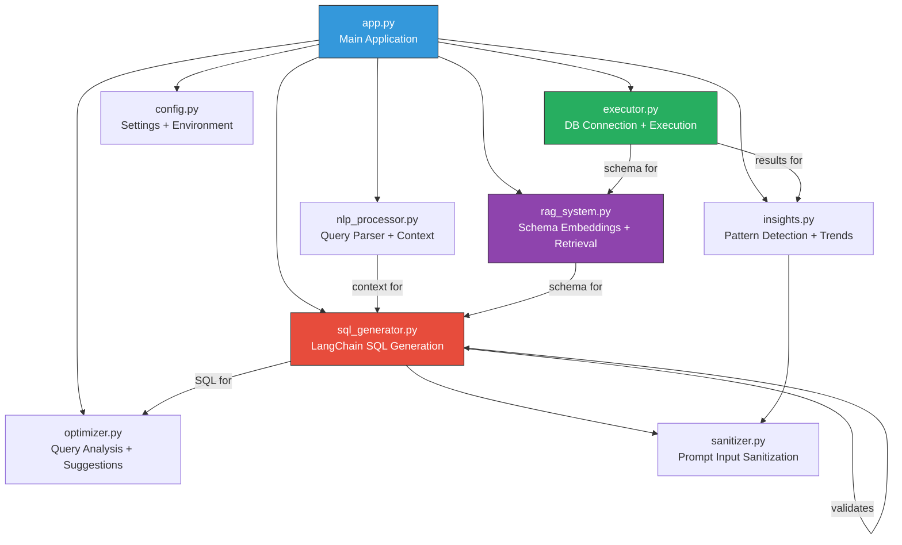
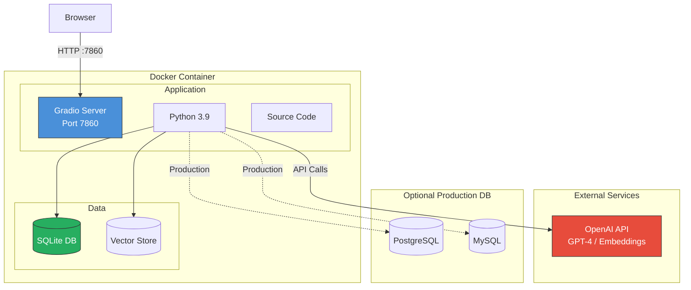

# SQL Query Buddy - Architecture Diagrams

## System Architecture



## Data Flow Pipeline

```mermaid
sequenceDiagram
    participant U as User
    participant UI as Gradio UI
    participant NLP as NLP Processor
    participant RAG as RAG System
    participant SQL as SQL Generator
    participant VAL as Validator
    participant OPT as Optimizer
    participant EXE as Executor
    participant DB as Database
    participant INS as Insight Engine

    U->>UI: Natural language question
    UI->>NLP: Parse input
    NLP->>NLP: Extract intent, entities, modifiers
    NLP->>RAG: Query + context
    RAG->>RAG: Embed query
    RAG->>RAG: Similarity search for relevant schema
    RAG-->>SQL: Schema context + conversation history
    SQL->>SQL: Build prompt with schema + history
    SQL->>SQL: LLM generates SQL
    SQL->>VAL: Validate generated SQL
    VAL-->>VAL: Check for injection, dangerous keywords
    VAL->>OPT: Valid SQL
    OPT-->>OPT: Analyze for optimization suggestions
    OPT->>EXE: Execute query
    EXE->>DB: Run SQL
    DB-->>EXE: Raw results
    EXE->>INS: Results + query context
    INS->>INS: Detect patterns & trends
    INS-->>UI: SQL + Results + Insights + Explanation
    UI-->>U: Formatted response
```

## Entity Relationship Diagram (Retail Commerce Schema)



## RAG Pipeline Detail



## Component Dependency Map



## Deployment Architecture


